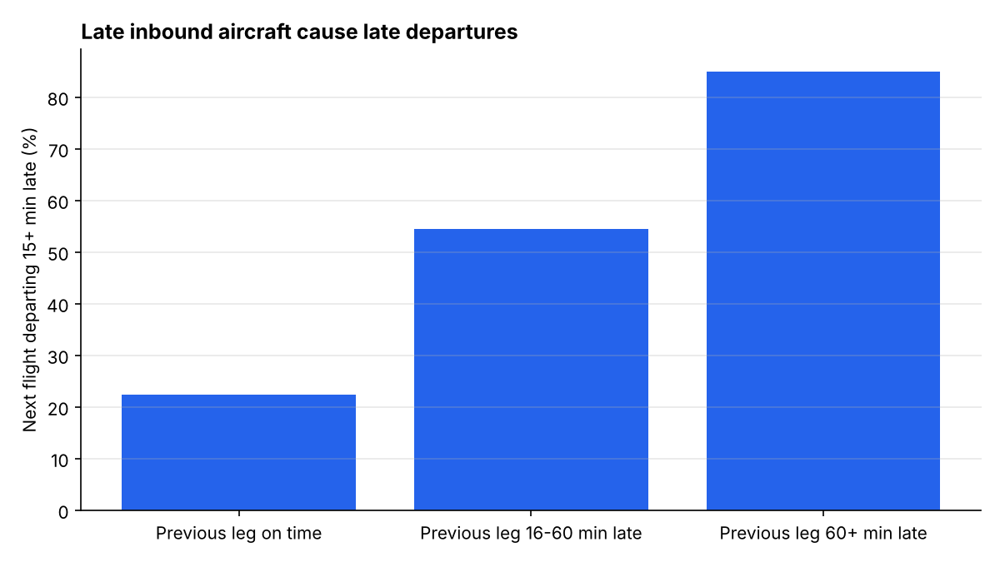
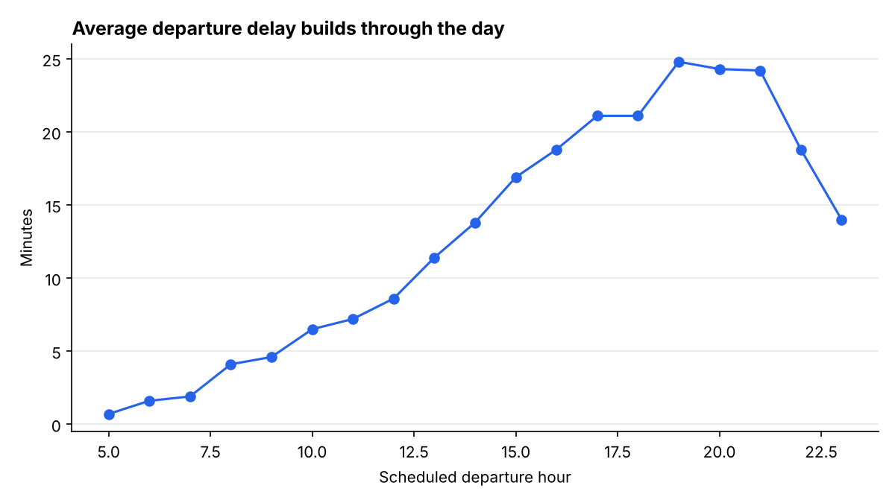
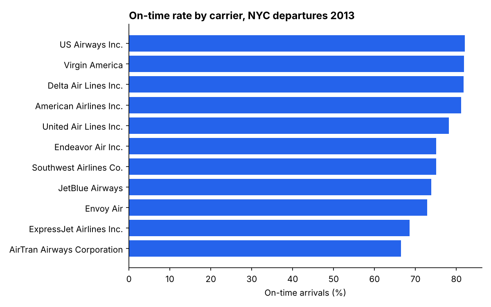

# NYC Flight Delay Analysis (PostgreSQL)

An end-to-end SQL analytics project on **336,776 flights** that departed New York City's three major airports (JFK, LGA, EWR) in 2013. The data spans five related tables: flights, airlines, airports, planes, and hourly weather.

**Business question:** What drives departure delays out of New York, and which carriers, routes, and conditions perform best and worst?

## Key findings

| Finding | Evidence |
|---|---|
| Delays **cascade through the day** | Average departure delay rises from **0.7 min** at 5 AM to **24.8 min** at 7 PM; on-time rate falls from 90% to 66% |
| **Late aircraft are the biggest knock-on driver** | When a plane's previous leg arrived 60+ min late, **85%** of its next departures left late, vs. **22%** when the previous leg was on time (3.8x) |
| **Precipitation is the most disruptive weather** | Cancellation rate **7.9%** in precipitation vs. **1.8%** in clear conditions (4.3x); on-time rate drops from 78% to 53% |
| **Carrier performance varies by ~16 points** | US Airways leads at 82.1% on-time; AirTran trails at 66.5%. ExpressJet carries 16% of NYC flights but ranks 10th of 11 |
| **Summer and December are the weakest months** | On-time rate bottoms out at 67–69% in June, July, and December, against a peak of 86.8% in September |
| **Newark underperforms** | EWR has the lowest on-time rate (74.4%) and the highest average departure delay (15.1 min) of the three airports |

Overall: **76.3%** of completed flights arrived on time (within 15 minutes, the U.S. DOT definition), and **2.45%** of scheduled flights were cancelled.





## What the SQL demonstrates

| Technique | Where |
|---|---|
| Two-layer schema (raw text staging, typed core tables) with primary and foreign keys | `01_schema.sql` |
| Generated columns for business flags (`is_on_time`, `is_cancelled`) | `01_schema.sql` |
| Type casting, cleaning, de-duplication with `ROW_NUMBER()`, indexing | `03_transform.sql` |
| Data quality checks: row reconciliation, NULL profiling, orphan keys with `NOT EXISTS` / anti-joins | `04_data_quality.sql` |
| CTEs, multi-table `JOIN`s, `GROUP BY` / `HAVING`, `CASE` bucketing, `FILTER` | `05_analysis.sql` |
| Window functions: `RANK()`, `ROW_NUMBER()`, `LAG()`, `SUM() OVER ()` | Q2, Q3, Q5, Q8 |
| Percentiles with `PERCENTILE_CONT` | Q1 |

### Analysis queries (`sql/05_analysis.sql`)

1. **Airport KPIs**: volume, cancellation rate, on-time rate, and mean/median delay per airport
2. **Carrier scorecard**: ranked on-time performance and each carrier's share of NYC flights
3. **Monthly trend**: on-time rate with month-over-month change using `LAG()`
4. **Delay by hour**: how delays build through the day
5. **Delay propagation**: links each flight to the same aircraft's previous NYC departure that day with `LAG() OVER (PARTITION BY tailnum, flight_date)`
6. **Weather impact**: joins flights to hourly origin weather and buckets conditions
7. **Worst routes**: lowest on-time routes among those with 500+ flights
8. **Best and worst carrier per airport**: `ROW_NUMBER()` within each origin

## Data quality notes

Findings from `04_data_quality.sql`:

- **8,255 flights** have no departure time and are treated as cancelled. Another **1,175** departed but have no arrival delay recorded (likely diverted). Both groups are excluded from on-time rates.
- **50,094 flights** reference tail numbers that are missing from the planes table, and **4 destinations** (BQN, PSE, SJU, STT; all Puerto Rico and U.S. Virgin Islands) are missing from the airports table. For this reason `tailnum` and `dest` are not enforced as foreign keys, and joins to those tables use `LEFT JOIN`.
- **1,556 flights** have no matching hourly weather reading and drop out of the weather analysis only.

**Limitation:** the dataset contains only flights departing NYC. "Previous leg" in Q5 is therefore the same aircraft's earlier NYC departure that day, measured by that flight's arrival delay at its destination.

## Project structure

```
sql/
  01_schema.sql         raw + core schemas, keys, generated columns
  02_load.sql           \copy CSVs into raw tables
  03_transform.sql      clean, cast, de-duplicate into core tables
  04_data_quality.sql   validation checks
  05_analysis.sql       8 business queries
run_analysis.py         runs the analysis, exports results/ and charts/
results/                query outputs (CSV)
charts/                 PNG charts
data/                   source CSVs
```

## How to run

Requires PostgreSQL 13+ and Python 3.9+.

```bash
# 1. Unzip the flights table (kept zipped to stay under GitHub's file size limits)
unzip data/flights.csv.zip -d data/

# 2. Create the database and build the tables
createdb flights
psql -d flights -f sql/01_schema.sql
psql -d flights -f sql/02_load.sql
psql -d flights -f sql/03_transform.sql
psql -d flights -f sql/04_data_quality.sql

# 3. Run the analysis and regenerate results and charts
pip install -r requirements.txt
PGDATABASE=flights python run_analysis.py
```

## Data source

The `nycflights13` dataset (CC0 public domain), compiled from the U.S. Bureau of Transportation Statistics on-time performance data, the FAA aircraft registry, and NOAA hourly weather observations.
"# NYC-flights-sql-analysis" 
